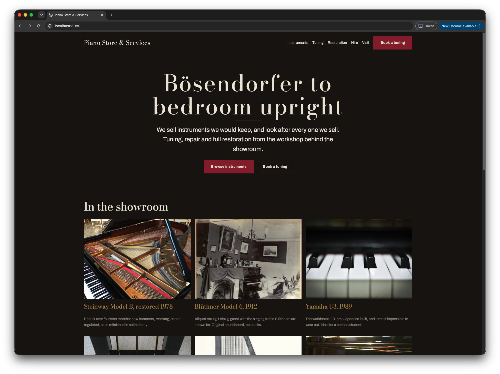
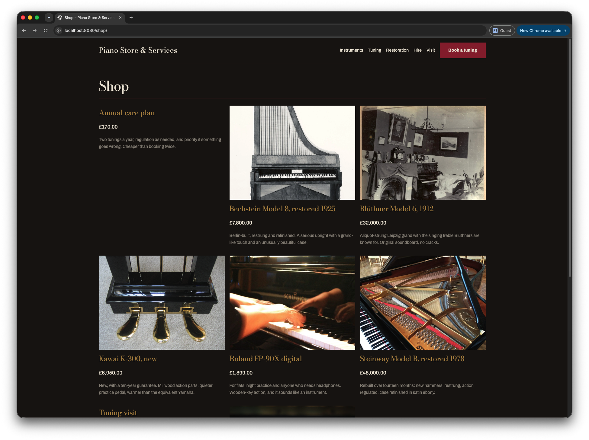
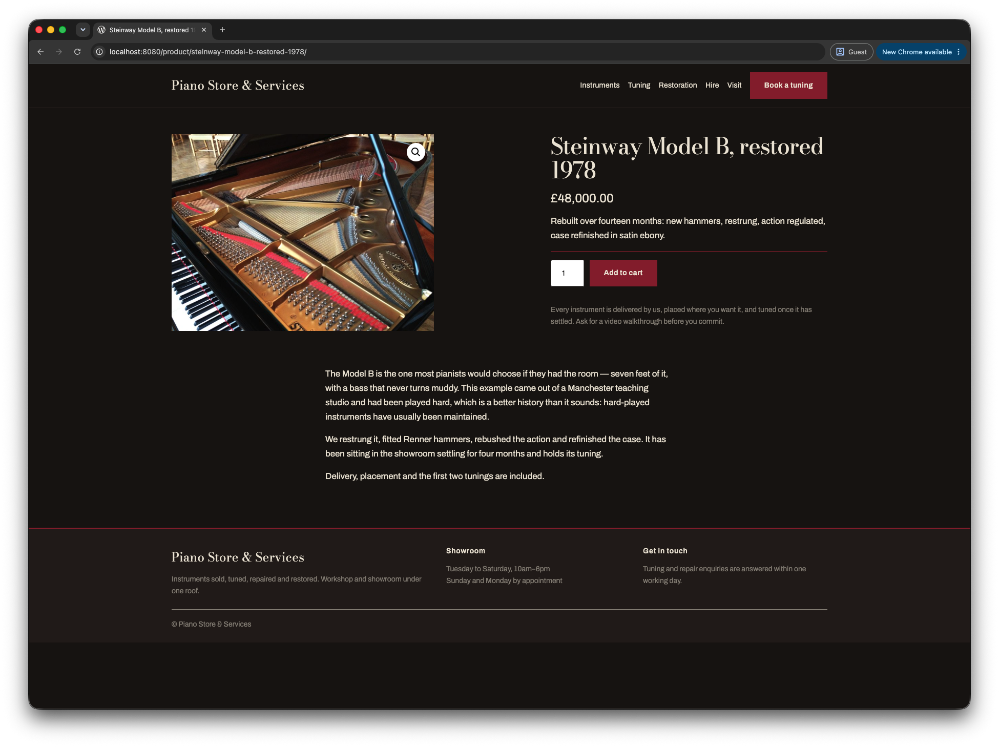
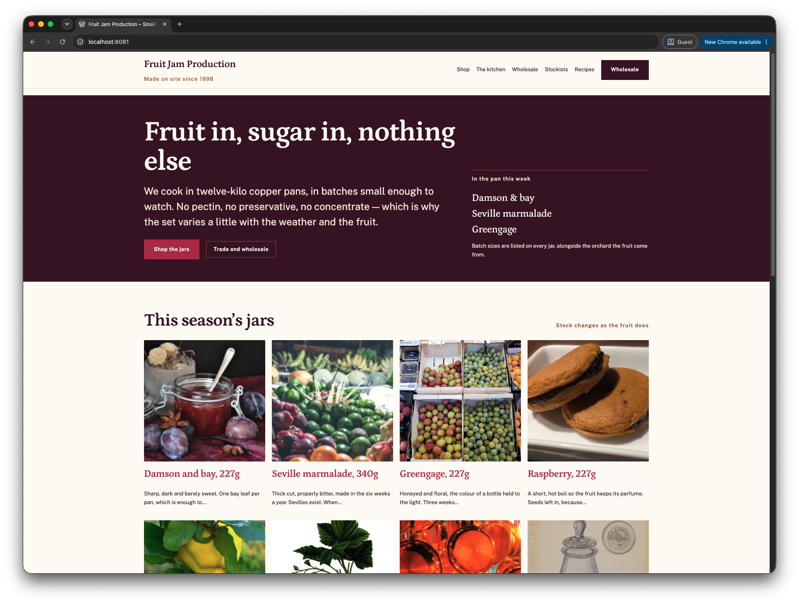
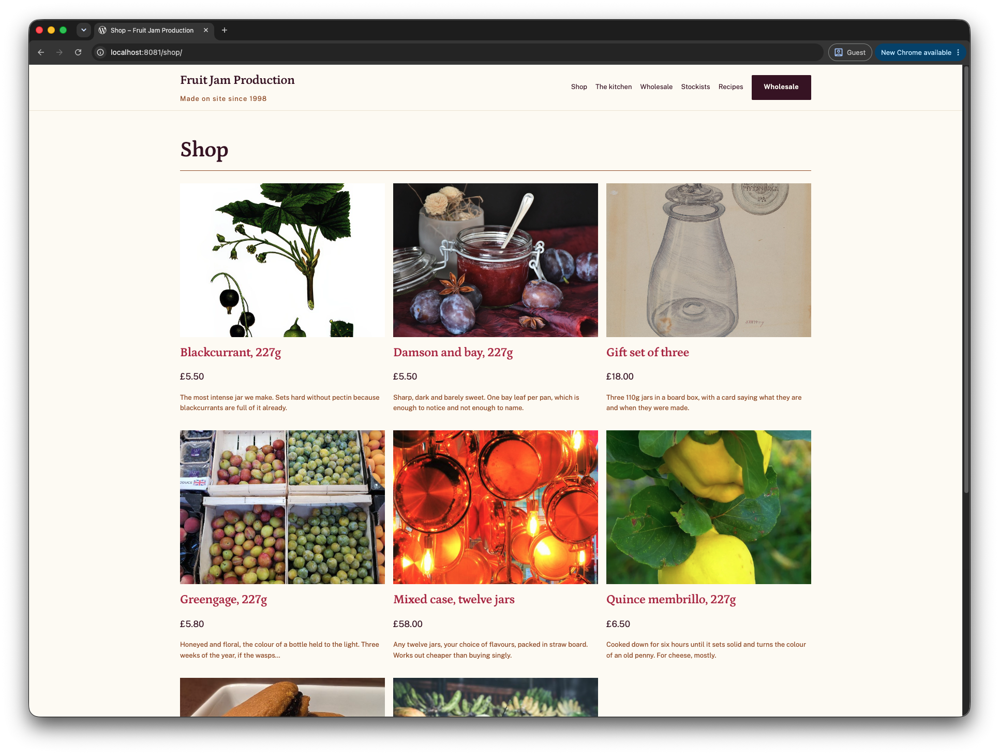
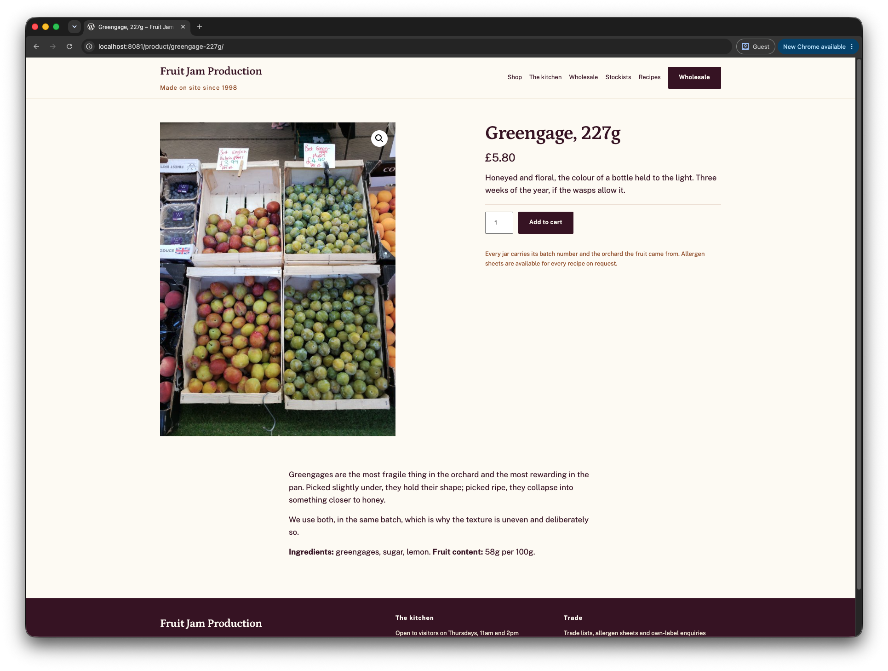

# Client Themes

A monorepo producing one standalone WordPress block theme per client website. Each theme is
delivered as a self-contained `.zip` with no runtime dependency on this repository.

See [docs/PRD.md](docs/PRD.md) for the product definition and [CLAUDE.md](CLAUDE.md) for the
command surface, architecture and the things that will otherwise cost you an hour.

## Quick start

```bash
npm install

npm run env:use -- piano                          # point local commands at this client's stack
npm run env:up && npm run env:init                # WordPress + WooCommerce at http://localhost:8080
npm run seed -- piano                             # demo products, pages and posts to look at
npm run env:cli -- theme activate client-piano    # show that client's theme
```

Each client runs as its own Docker Compose project with its own database, so two client sites can
run side by side without their content mixing — `piano` on :8080, `jam` on :8081.

That last line is also the fix when a site looks empty. `npm run verify` reactivates a bundled
theme when it finishes — deliberately, so it never deletes a theme that is still in use — so after
verifying you are looking at Twenty Twenty-Five rendering your client's content, not the client's
theme. The products and images are still there; re-activate and they reappear.

## Adding a client

```bash
npm run new-client -- acme "Acme Ltd"   # scaffold themes/client-acme
npm run build -- client-acme            # compile its assets
npm run verify -- client-acme           # prove it is deliverable
```

`npm run verify` is the gate that decides whether a theme can be handed over. It lints, validates
`theme.json`, runs Theme Check, builds and packages the theme, **installs that zip into WordPress
and activates it**, renders every route while watching for PHP notices, and runs an accessibility
scan against WCAG 2.1 AA. A theme that passes has been proven as the packaged artifact, not as a
working tree. It fails closed: a step that cannot verify its claim fails the run rather than
reporting a pass.

## Current clients

| Theme | Business |
|---|---|
| `client-piano` | Piano dealer — instrument sales, tuning, repair, restoration and hire |
| `client-jam` | Preserves producer — retail jars and wholesale supply |

Both sell through WooCommerce and ship self-hosted OFL fonts. Nothing below is a mockup — these
are the running sites.

### Piano Store & Services

Ebony lacquer, aged ivory and hammer-felt crimson, set in Bodoni Moda. The home page opens with
the shop's name treated the way a maker's name is engraved on a fallboard, over the felt strip
that sits under the keys.

| Home | Shop | Product |
|---|---|---|
| [](screenshots/piano1.png) | [](screenshots/piano2.png) | [](screenshots/piano3.png) |

### Fruit Jam Production

Sugar white, damson and copper, set in Petrona. The product itself supplies the palette, and the
hero leads with what is actually in the pan this week rather than a slogan.

| Home | Shop | Product |
|---|---|---|
| [](screenshots/jam1.png) | [](screenshots/jam2.png) | [](screenshots/jam3.png) |

The two share a foundation and no design decisions — that is the point of the isolation model.

## Building a theme into a zip

```bash
npm run build -- client-piano       # compile src/ into the theme's build/
npm run package -- client-piano     # zip it -> dist/client-piano-1.0.0.zip
```

Or in one step, gated:

```bash
npm run verify -- client-piano      # lint, check, build, package, install, smoke, a11y
```

`verify` does everything `build` and `package` do and then proves the result works, so it is the
command to use before sending anything to a client. Reach for `build` and `package` on their own
while iterating.

A few things worth knowing:

- **The version comes from the theme's own `style.css`.** `Version: 1.0.0` produces
  `client-piano-1.0.0.zip`. Bump that header to ship an update.
- **`package` refuses to run without a build**, rather than quietly zipping a theme with no
  compiled CSS or JS. It also lints first — pass `--skip-lint` to bypass that while iterating.
- **`dist/` is gitignored.** Zips are build output, not source; regenerate them rather than
  committing them.
- Each theme versions independently — shipping a `client-piano` fix never touches `client-jam`.

## Delivering a theme to a client's website

The zip contains one folder named after the theme and nothing else — no build tooling, no
`src/`, no repo scaffolding. It installs on any standard WordPress host.

### What the client's site needs first

| Requirement | Value |
|---|---|
| WordPress | 6.6 or newer |
| PHP | 8.1 or newer |
| WooCommerce | Required for the shop, cart and checkout pages |

WooCommerce is a free plugin the client installs themselves. Without it the theme still activates
and every non-shop page renders normally — the product templates simply sit unused.

### Installing it

**Through wp-admin** — what most clients will do:

1. **Appearance → Themes → Add New → Upload Theme**
2. Choose the `.zip`, then **Install Now**
3. **Activate**

**Over WP-CLI**, if the host provides SSH:

```bash
wp theme install client-piano-1.0.0.zip --activate
```

**Over SFTP**, as a last resort: unzip locally and upload the `client-piano/` folder into
`wp-content/themes/`, then activate it under Appearance → Themes.

### After activating

1. **Settings → Permalinks** — choose "Post name" and save. WooCommerce's `/shop/`, `/cart/` and
   `/checkout/` routes will 404 until permalink rules are flushed, and saving is what flushes them.
2. **Add products.** The theme ships templates, not stock — the client adds their own products,
   prices and photographs.
3. **Set the menu.** Appearance → Editor → Navigation, or the site falls back to listing every
   published page alphabetically.
4. **Adjust the design** in Appearance → Editor → Styles. Colours, fonts, spacing and layout
   widths all come from `theme.json`, so the client can change them without touching code and
   without losing anything on the next update.

### Updating a delivered theme

Bump the version in the theme's `style.css`, re-run `npm run verify`, and send the new zip. The
client uploads it the same way; WordPress notices the theme already exists and offers to replace
it. Their content, settings and Site Editor changes survive the replacement.

Version each theme independently — `client-jam` never needs touching to ship a `client-piano` fix.

## Licensing

This repository is Apache-2.0. **Delivered themes are GPL-2.0-or-later**, declared in each
theme's `style.css`, as WordPress themes must be. Bundled fonts and images must be cleared for
commercial client use — the demo content uses CC0 and public-domain images only, so no client
site inherits an attribution obligation.
